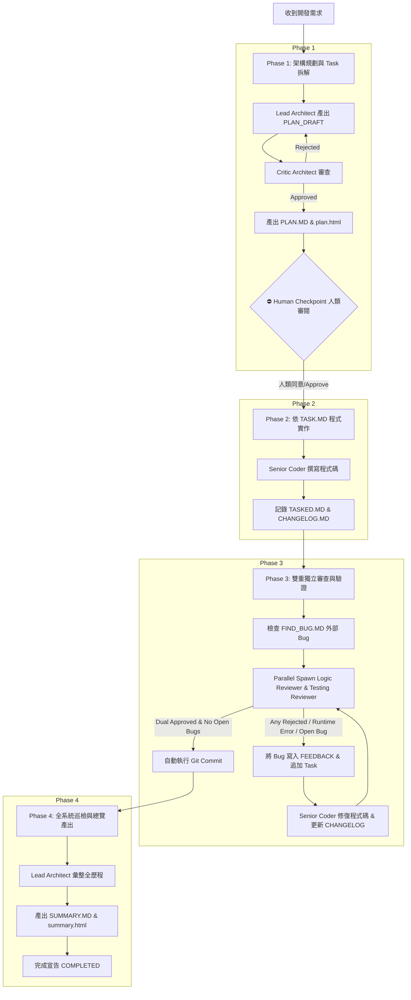

# Antigravity Agent 多 Agent 自動化開發工作流框架 (Multi-Agent Engineering Pipeline)

本專案包含一套基於 **Google Antigravity AI Agent** 規範所打造的**多 Agent 自動化軟體工程工作流框架**。透過全域規範 (`GEMINI.md`) 與階段式流程定義 (`.antigravity/workflow.md`)，實現需求規劃、架構辯論、程式實作、雙重獨立審查、Bug 無上限修復迴圈以及自動化 Git Commit 的完整閉環。

---

## 📌 核心特色 (Key Features)

1. **嚴格防幻覺與依據導向 (Zero Hallucination)**：所有 Agent 決策與變更均必須 100% 依據實體檔案與現有程式碼。
2. **4 階段嚴格開發管線 (4-Phase Pipeline)**：包含規劃辯論、程式編寫、雙重審查（邏輯 + 動態測試）、結案總覽。
3. **人類審核門檻 (Human Checkpoint)**：Phase 1 規劃完成後強制暫停，產出 HTML 預覽檔供人類審閱確認後方可動工。
4. **雙審獨立驗證與修到好機制 (Fix Until Approved)**：由 Logic Reviewer 與 Testing Reviewer 雙重獨立卡關，未通過前持續進行修復迴圈。
5. **外部 Bug 閉環管理 (External Bug Channel)**：提供 `FIND_BUG.MD` 作為人類或外部 AI Agent 提交 Bug 的統一入口，自動轉化為修復 Task。
6. **自動化 Commit 與 HTML 視覺化報告**：審查通過後自動 Trigger Git Commit，並產出 `plan.html` 與 `summary.html` 視覺化頁面。

---

## 📂 檔案與目錄結構 (Directory Structure)

```text
.
├── GEMINI.md                    # 全域工作流規範與操作協定 (Global Protocol)
├── README.md                    # 本說明文件
├── .antigravity/                # Subagent 角色 Prompt 與工作流定義
│   ├── workflow.md              # 4-Phase 主執行管線 (Master Pipeline SOP)
│   ├── lead-architect.md        # 主架構師 Role Prompt
│   ├── critic-architect.md      # 批判型架構審查員 Role Prompt
│   ├── senior-coder.md          # 資深開發工程師 Role Prompt
│   ├── logic-reviewer.md        # 邏輯與靜態審查員 Role Prompt
│   └── testing-reviewer.md      # 動態與測試審查員 Role Prompt
└── agent_docs/                  # 所有 Agent 產出的文件、Log 與 HTML 報告目錄
    ├── PROGRESS.MD              # 目前 Phase 與進度狀態
    ├── PLAN.MD / plan.html      # 開發計畫與 Phase 1 視覺化預覽頁
    ├── TASK.MD / TASKED.MD      # 待執行與已完成任務清單
    ├── FIND_BUG.MD              # 外部 Bug 提交日誌
    ├── REVIEW_LOGIC.MD          # 靜態邏輯審查報告
    ├── REVIEW_TEST.MD           # 動態與 E2E 測試 Log
    ├── REVIEW_FEEDBACK.MD       # 審查退件與 Runtime Bug 彙整
    ├── CHANGELOG.MD             # Bug 與程式碼修改詳細履歷
    └── SUMMARY.MD / summary.html# Phase 4 結案總覽報告與視覺化頁面
```

---

## 📜 核心規範摘要 (`GEMINI.md`)

`GEMINI.md` 是 Agent 的最高行為準則 (Global Operating Protocol)，具體規範如下：

1. **Master Orchestrator 職責**：預設角色為總協調者，嚴格按 `.antigravity/workflow.md` 調度各 Subagent。
2. **禁止幻想原則**：Agent 不可憑空捏造 API 或邏輯，必須讀取實體 Codebase。
3. **修到好為止條款 (Fix Until Approved)**：取消修復次數限制，直到邏輯與測試雙審查員皆標註 `APPROVED`。
4. **異常閉環條款**：任何階段發生的 Runtime Error 一律不得隨意改 Code，需走標準「紀錄 ➔ Task 派發 ➔ 修復 ➔ 雙審」管道。
5. **自動 Git Commit 條款**：雙審通過且無未修復的 `OPEN` Bug 時，自動執行 Git Commit：
   ```bash
   git add .
   git commit -m "feat/fix: [TASK-ID/BUG-ID] 簡短描述" -m "重點摘要"
   ```
6. **HTML 視覺化報告規範**：Phase 1 強制產出 `agent_docs/plan.html`，Phase 4 強制產出 `agent_docs/summary.html`。

---

## 👥 Subagent 角色分工 (`.antigravity/`)

| Agent 角色 | 檔案路徑 | 職責說明 | 可用工具/權限 |
| :--- | :--- | :--- | :--- |
| **Lead Architect** | `.antigravity/lead-architect.md` | 主架構師。負責分析需求、規劃架構、拆解任務，編譯 `plan.html` 與結案 `summary.html`。嚴禁修改原始碼。 | file_reader, file_writer, terminal |
| **Critic Architect** | `.antigravity/critic-architect.md` | 批判型架構審查員。負責針對 `lead-architect` 的規劃草稿進行可行性與安全性挑戰，輸出 `PLAN_FEEDBACK.MD`。嚴禁修改原始碼。 | file_reader, file_writer |
| **Senior Coder** | `.antigravity/senior-coder.md` | 資深開發工程師。依據 `PLAN.MD`、`TASK.MD` 與 `FIND_BUG.MD` 進行程式碼實作與 Bug 修復，並維護 `CHANGELOG.MD`。 | file_reader, file_writer, terminal, web_search |
| **Logic Reviewer** | `.antigravity/logic-reviewer.md` | 邏輯與靜態審查員。比對 `git diff` 與計畫，檢查邏輯漏洞與邊界條件。雙審通過時觸發 Git Commit。嚴禁修改業務程式碼。 | file_reader, file_writer, terminal |
| **Testing Reviewer** | `.antigravity/testing-reviewer.md` | 動態與測試審查員。透過 Terminal 實際執行單元測試、E2E 測試或 API 呼叫，驗證運行穩定度。嚴禁修改業務程式碼。 | file_reader, file_writer, terminal |

---

## 🔄 4 階段執行流程 (4-Phase Execution Pipeline)



### 階段詳細說明

#### Phase 1: 架構規劃與 Task 拆解 (Dual Planner Debate & HTML Output)
1. Orchestrator 更新 `agent_docs/PROGRESS.MD` 為 `Phase 1: Planning`。
2. 啟動 `lead-architect` 分析需求並產出 `PLAN_DRAFT.MD` 與 `DOCS.MD`。
3. 啟動 `critic-architect` 進行辯論與對照 Codebase 審查：
   - 標註 `REJECTED` ➔ 退回 `lead-architect` 重新修正。
   - 標註 `APPROVED` ➔ 產出 `agent_docs/PLAN.MD` 與 `agent_docs/TASK.MD`。
4. `lead-architect` 將計畫編譯為 **`agent_docs/plan.html`**。
5. **⛔ Human Checkpoint (強制阻斷)**：等待人類使用者開啟 `plan.html` 審閱並回覆「同意/Approve」後方可進入 Phase 2。

#### Phase 2: 依據 TASK.MD 實作與變更紀錄
1. Orchestrator 更新進度為 `Phase 2: Coding`。
2. 啟動 `senior-coder` 依 `TASK.MD` 進行開發與自我測試。
3. 變更紀錄：完成項目移動至 `agent_docs/TASKED.MD`，詳細技術變更紀錄於 `agent_docs/CHANGELOG.MD`。

#### Phase 3: 雙重獨立審查、修復與自動 Git Commit
1. Orchestrator 更新進度為 `Phase 3: Code Review & Runtime Verification`。
2. 檢查 `agent_docs/FIND_BUG.MD` 是否有 `OPEN` 的外部回報項目。
3. 並行啟動 `logic-reviewer` (靜態邏輯) 與 `testing-reviewer` (實體測試)。
4. **無上限修復迴圈 (Infinite Fix Loop)**：
   - 若有任一 `REJECTED`、`OPEN` Bug 或 Runtime Error ➔ 整理步驟寫入 `REVIEW_FEEDBACK.MD` ➔ 追加 Task ➔ 派發 `senior-coder` 修正 ➔ 重新觸發雙審查。
5. **Auto Git Commit**：當雙審查皆標示 `APPROVED` 且無 `OPEN` Bug，自動執行 Git Commit。

#### Phase 4: 最終架構巡檢與單一 HTML 總覽產出
1. Orchestrator 更新進度為 `Phase 4: Summary`。
2. 啟動 `lead-architect` 巡檢全系統與所有紀錄，產出 `agent_docs/SUMMARY.MD` 與單一結案檔 **`agent_docs/summary.html`**。
3. `summary.html` 內含：系統架構圖、使用教學、Bug 修復對照表、完整檔案變更履歷。
4. 標註 `agent_docs/PROGRESS.MD` 為 `COMPLETED`。

---

## 🚀 使用說明 (How to Use)

### 1. 新增或備份至 GitHub
您可以直接將此儲存庫 Push 至 GitHub 作為規範範本或開發專案：
```bash
git add .
git commit -m "docs: add README.md for Antigravity Agent workflow and GEMINI protocol"
git push origin main
```

### 2. 在 Antigravity 中啟動工作流
當您在 Antigravity AI Agent 環境中提出新的開發需求或修改任務時：
- Agent 會自動載入 `GEMINI.md` 作為最高行為準則。
- Agent 會以 **Master Orchestrator** 身份按照 `.antigravity/workflow.md` 開始執行 Phase 1。
- 當到達 **Phase 1 終點** 時，請開啟 `agent_docs/plan.html` 審閱規劃，回覆 `Approve` 即可讓 Agent 繼續執行後續實作。

### 3. 外部 Bug 提交方式
若在測試或使用過程中發現問題，人類使用者或外部 AI 測試 Agent 可直接寫入 `agent_docs/FIND_BUG.MD`：
```markdown
## [2026-07-22 17:00:00] Bug Title
- Status: OPEN
- Description: 詳細錯誤描述與重現步驟
- Log: 相關錯誤日誌
```
Orchestrator 與 Coder 會在 Phase 3 自動將其擷取並修復至 `Status: RESOLVED`。
